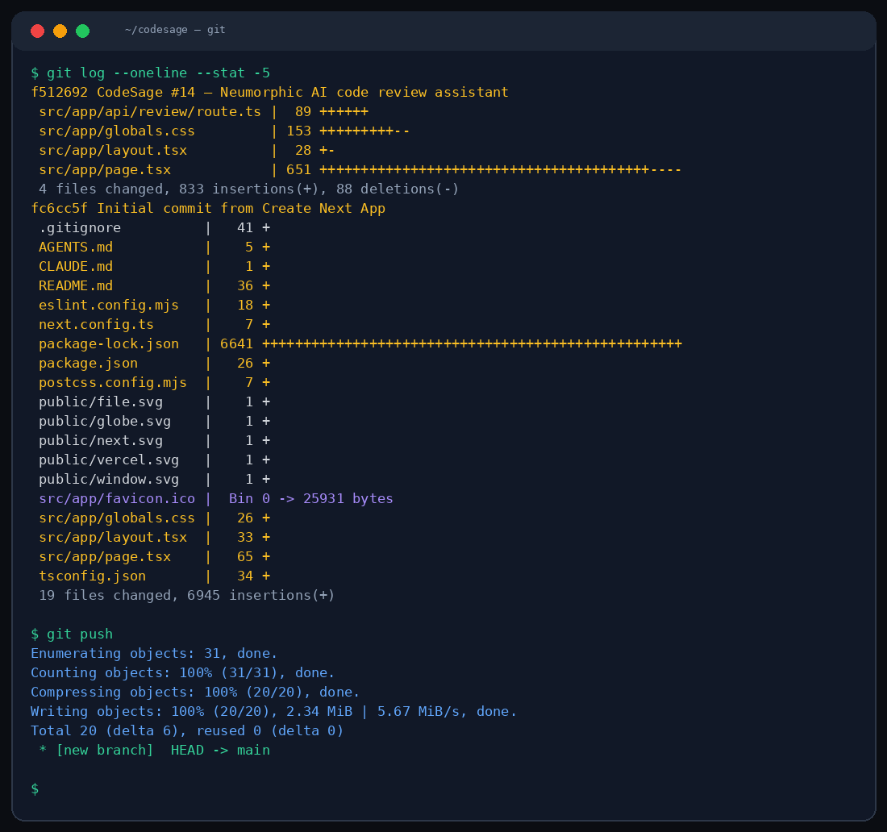

# 💻 CodeSage

> AI code review assistant. Paste your code, get instant feedback on bugs, performance, style, and best practices.



CodeSage analyzes your code snippets and provides structured reviews covering:
- Potential bugs and logic errors
- Performance bottlenecks
- Code style and readability improvements
- Security concerns
- Best practice suggestions

## Run locally

```bash
npm install && npm run dev
```

Then open `http://localhost:3000`.

## How to use

1. Select your programming language from the dropdown
2. Paste or type your code in the editor
3. Choose a review focus (general, performance, security, style)
4. Click **Analyze** — get a detailed review with line-by-line feedback

## Tech

- Next.js 16 + TypeScript
- Tailwind CSS 4
- MiMo v2.5 Pro (Xiaomi)

## Environment

```
MIMO_API_URL=http://localhost:19911/v1/chat/completions
MIMO_API_KEY=your_key
```

## Project layout

```
src/app/
├── api/review/route.ts    ← Code review API endpoint
├── page.tsx               ← Editor + review panel
├── globals.css            ← Neumorphic light theme
└── layout.tsx
```

## Design

Light neumorphic UI. Soft shadows on a light gray canvas (#e8ecf1), purple accent (#6c5ce7). Buttons use inset/raised shadow states for tactile feedback. Inter font throughout.

---

*Crafted with MiMo v2.5 Pro* — AI code analysis powered by [Xiaomi's MiMo](https://huggingface.co/XiaomiMiMo).

MIT
